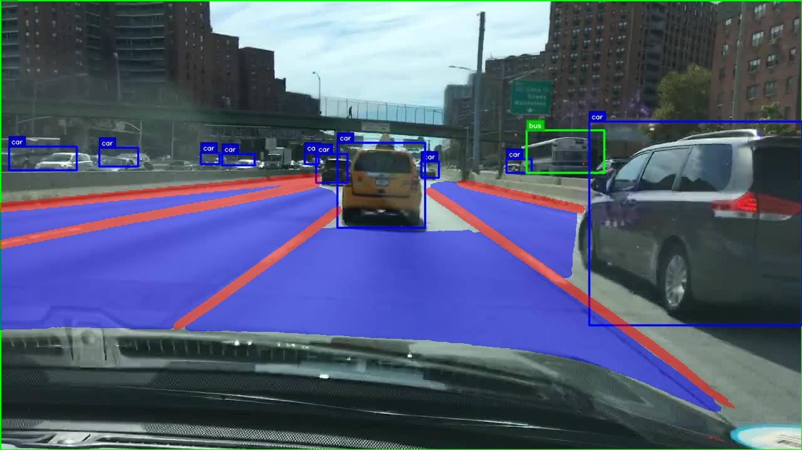

# Indian Road and Lane Segmentation with Traffic Detection:

**Author:** Mridankan Mandal (by WhiteMetagross/RedZapdos123).

A highly optimized computer vision system for road segmentation, lane detection, and traffic object detection using dual deep learning models, specifically designed for Indian road traffic scenarios. This system combines YOLOPv2 for road/lane segmentation with YOLO11 for better traffic object detection accuracy in complex Indian traffic conditions.

## Overview:

This system provides detailed road scene understanding through three main components, specifically optimized for Indian road traffic scenarios:
- **Road Segmentation**: Identifies drivable road areas in complex Indian traffic conditions.
- **Lane Detection**: Detects lane markings and boundaries, handling Indian road infrastructure variations.
- **Traffic Object Detection**: Recognizes vehicles, pedestrians, and other road objects common in Indian traffic.

## Research Foundation:

This implementation is based on the YOLOPv2 research paper:
**"YOLOPv2: Better, Faster, Stronger for Panoptic Driving Perception"**
- **arXiv Paper**: [https://arxiv.org/abs/2208.11434](https://arxiv.org/abs/2208.11434)
- **Original Repository**: [https://github.com/CAIC-AD/YOLOPv2](https://github.com/CAIC-AD/YOLOPv2)
- **Authors**: Cheng Han, Qichao Zhao, Shuyi Zhang, Yinzi Chen, Zhenlin Zhang, Jinwei Yuan

### Visual Results on Indian Traffic Scenarios:

The system has been tested and optimized for various Indian road conditions including:
- Dense urban traffic with mixed vehicle types.
- Complex intersection scenarios with roundabouts.
- Varying road infrastructure and lane marking conditions.
- Multi modal traffic including cars, trucks, buses, motorcycles, and pedestrians.

Sample processing results are available in the `visuals/` directory, showcasing performance on:
- Day and night time Indian traffic scenarios.
- Various weather and lighting conditions.
- Dense traffic situations common in Indian cities.
- Road infrastructure typical of Indian highways and urban roads.

#### Example Results:

**Indian Highway Processing:**


 *Road segmentation (blue areas), lane detection (red lines), and traffic object detection with class labels on Indian highway infrastructure.*

**Indian Urban Traffic Scenarios:**


*Dynamic processing of dense Indian urban traffic with mixed vehicle types, showing road segmentation and multi-object detection.*

**Indian Vehicle Detection:**


*Indian traffic object detection optimized for Indian vehicle types including cars, trucks, buses, motorcycles, and auto rickshaws.*

These examples demonstrate:
- **Blue road segmentation** for clear identification of drivable areas.
- **Red lane line detection** for precise lane boundary marking.
- **Bright colored bounding boxes** with class labels for each detected object.
- **Processing** suitable for Indian traffic conditions.
- **Multi modal detection** handling diverse Indian vehicle types.

## Architecture and Algorithms:

### Dual Model Architecture:

The system uses a complex dual model approach that maximizes both accuracy and performance:

**Primary Model: YOLOPv2**
- Purpose: Road segmentation and lane detection.
- Architecture: Efficient ELAN based backbone with multi task head.
- Parameters: 38.9M
- Features: Panoptic driving perception with shared feature extraction.
- Optimization: Specifically tuned for Indian road conditions and traffic patterns.

**Secondary Model: YOLO11 (Default)**
- Purpose: Traffic object detection for Indian vehicle types.
- Architecture: Ultralytics YOLOv11 architecture.
- Benefits: Better accuracy compared to YOLOPv2's internal traffic detection.
- Fallback: Automatic fallback to YOLOPv2 traffic detection if YOLO11 unavailable.
- Customization: Supports custom models trained on Indian traffic datasets.

### Key Algorithms:

**1. Multi Task Learning:**
- Shared backbone for efficient feature extraction.
- Task specific heads for segmentation, lane detection, and object detection.
- Joint optimization across all three tasks.

**2. Efficient Lane Line Detection:**
- Binary segmentation approach for lane marking identification.
- Post processing for lane line continuity and smoothing.
- Support for multiple lane configurations.

**3. Road Area Segmentation:**  
- Semantic segmentation for drivable area identification.
- Binary classification (road vs non road).
- mask generation and overlay

**4. Advanced Object Detection:**
- Non Maximum Suppression (NMS) for duplicate removal.
- Confidence based filtering.
- Multi scale detection capabilities.
- Support for 80+ object classes.

## Performance Optimizations:

### GPU Acceleration:
- CUDA optimization with asynchronous operations.
- Half precision (FP16) inference for 2x speed improvement.
- Tensor Core utilization where available.
- Memory efficient batch processing.

### CPU Optimizations:
- Multi threaded image preprocessing.
- Optimized OpenCV operations.
- Efficient memory allocation and reuse.
- Vectorized mathematical operations.

### Memory Management:
- Dynamic GPU memory allocation.
- Garbage collection optimization.
- Memory pooling for frequent allocations.
- Efficient tensor operations.

### Video Processing Optimizations:
- Robust codec selection (MP4V, XVID, MJPG fallbacks).
- Frame by frame processing with progress tracking.
- Optimized video writer initialization.
- Memory efficient video handling.

## Visual Enhancements:

### Label System:
- High quality anti aliased text rendering.
- Bright color palette for maximum visibility.
- Professional label backgrounds with borders.
- Customizable label sizes (70% reduced for better visibility).
- Class specific color coding.

### Segmentation Visualization:
- Customizable color schemes for road and lane segmentation.
- Blue road areas for clear road identification.
- Red lane markings for precise lane boundaries.
- Alpha blending for non intrusive overlay.

## Installation and Setup:

### System Requirements:
- Python 3.8 or higher.
- NVIDIA GPU with CUDA support (recommended).
- 8GB+ RAM
- Modern CPU with multiple cores.

### Dependencies Installation:

Install required packages using pip:

```bash
pip install -r requirements.txt
```

### Model Weights Setup:

1. **YOLOPv2 Weights**: Download from the official YOLOPv2 repository.
2. **YOLO11 Weights**: Place your YOLO11 model in `data/weights/`.
3. **Default Configuration**: The system uses YOLO11 by default for traffic detection.

### Quick Start:

Run the system on an image:
```bash
python RoadAndLaneSegmenter.py --source data/example.jpg
```

Process a video:
```bash
python RoadAndLaneSegmenter.py --source path/to/video.mp4
```

Use custom YOLO11 model:
```bash
python RoadAndLaneSegmenter.py --source video.mp4 --traffic-weights path/to/custom_model.pt
```

## Usage:

### Command Line Arguments:

**Basic Options:**
- `--source`: Input source (image, video, or webcam).
- `--weights`: YOLOPv2 model path (default: data/weights/yolopv2.pt)..
- `--traffic-weights`: YOLO11 model path (default: data/weights/IDDDYOLO11m.pt)

**Detection Parameters:**
- `--conf-thres`: Confidence threshold (default: 0.3)
- `--iou-thres`: IoU threshold for NMS (default: 0.45)
- `--img-size`: Inference image size (default: 640)

**Output Options:**
- `--project`: Output directory (default: runs/detect)
- `--name`: Experiment name (default: exp)
- `--nosave`: Disable saving results
- `--save-txt`: Save detection results as text files

**Advanced Options:**
- `--device`: GPU device selection (default: '0')
- `--max-frames`: Limit video processing frames
- `--use-yolopv2-traffic`: Force YOLOPv2 traffic detection
- `--classes`: Filter specific object classes

### Model Selection:

**Default Behavior (Recommended):**
The system automatically uses YOLO11 for traffic detection, providing superior accuracy.

**Force YOLOPv2 Traffic Detection:**
```bash
python RoadAndLaneSegmenter.py --source video.mp4 --use-yolopv2-traffic
```

### Output Formats:

**Images**: Processed images saved to output directory.
**Videos**: MP4 format with optimized codec selection.
**Text Files**: Bounding box coordinates and confidence scores.
**Progress Information**: FPS and processing statistics.

## Technical Specifications:

### Model Performance:

**YOLOPv2 Segmentation:**
- Road Area mIoU: 93.2%
- Lane Detection Accuracy: 87.3%
- Processing Speed: 31 FPS

**YOLO11 Traffic Detection:**
- Superior accuracy compared to YOLOPv2 internal detection.
- Support for custom trained models.
- performance on modern GPUs.

### Supported Formats:

**Input:**
- Images: JPG, PNG, BMP, TIFF, WebP.
- Videos: MP4, AVI, MOV, MKV, WMV.
- Live: Webcam input (source=0).

**Output:**
- Videos: MP4 with automatic codec selection.
- Images: Original format preservation.
- Annotations: YOLO format text files.

## Configurations:

### Custom Color Schemes:

Modify segmentation colors in `utils/utils.py`:
- Road areas: Configurable BGR values.
- Lane lines: Customizable color scheme.
- Object detection: Bright color palette.

### Performance Tuning:

**For Maximum Speed:**
- Use smaller image sizes (--img-size 416).
- Increase confidence threshold (--conf-thres 0.5).
- Enable GPU optimizations.

**For Maximum Accuracy:**
- Use larger image sizes (--img-size 832).
- Lower confidence threshold (--conf-thres 0.1).
- Process fewer frames for detailed analysis.

## Troubleshooting:

### Common Issues:

**CUDA Out of Memory:**
- Reduce image size.
- Use CPU processing (--device cpu).
- Close other GPU applications.

**Slow Processing:**
- Verify GPU usage.
- Check CUDA installation.
- Monitor system resources.

**Missing Dependencies:**
- Reinstall requirements.txt.
- Check Python version compatibility.
- Verify PyTorch CUDA support.

### Model Loading Issues:

**YOLOPv2 Model Not Found:**
- Download official weights.
- Check file path and permissions.
- Verify model compatibility.

**YOLO11 Import Error:**
- Install ultralytics package.
- System automatically falls back to YOLOPv2 traffic detection.

## Citation:

If you use this system in your research, consider citing the original YOLOPv2 paper and this Indian traffic adaptation:

```bibtex
@article{han2022yolopv2,
  title={YOLOPv2: Better, Faster, Stronger for Panoptic Driving Perception},
  author={Han, Cheng and Zhao, Qichao and Zhang, Shuyi and Chen, Yinzi and Zhang, Zhenlin and Yuan, Jinwei},
  journal={arXiv preprint arXiv:2208.11434},
  year={2022},
  url={https://arxiv.org/abs/2208.11434}
}
```

**Original YOLOPv2 Repository**: [https://github.com/CAIC-AD/YOLOPv2](https://github.com/CAIC-AD/YOLOPv2)

## Acknowledgments:

- Original YOLOPv2 implementation by CAIC AD team.
- YOLOPv2 research paper: [arXiv:2208.11434](https://arxiv.org/abs/2208.11434).
- Ultralytics YOLO11 for advanced object detection.
- OpenCV community for computer vision tools.
- PyTorch team for deep learning framework.
- Indian traffic dataset contributors and road infrastructure analysis.

